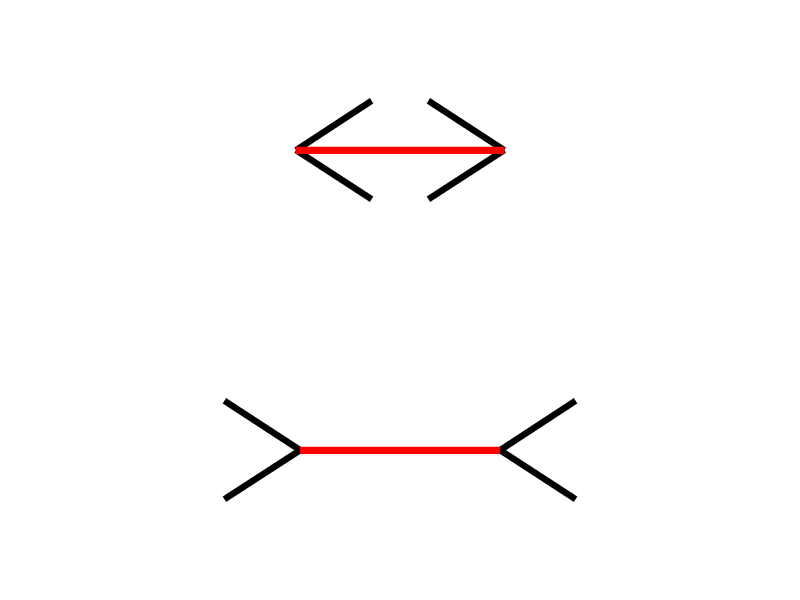
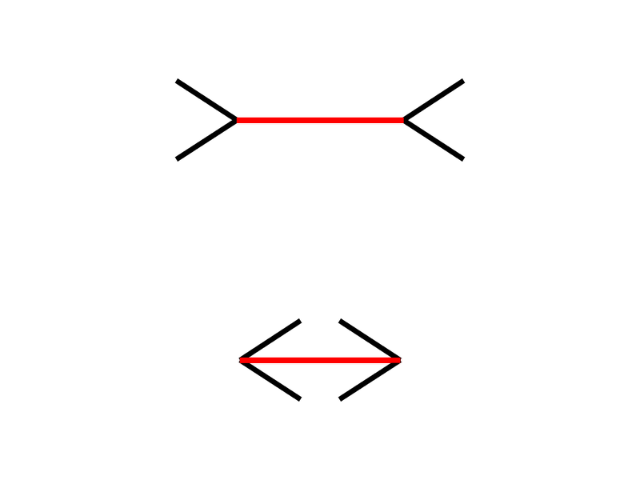
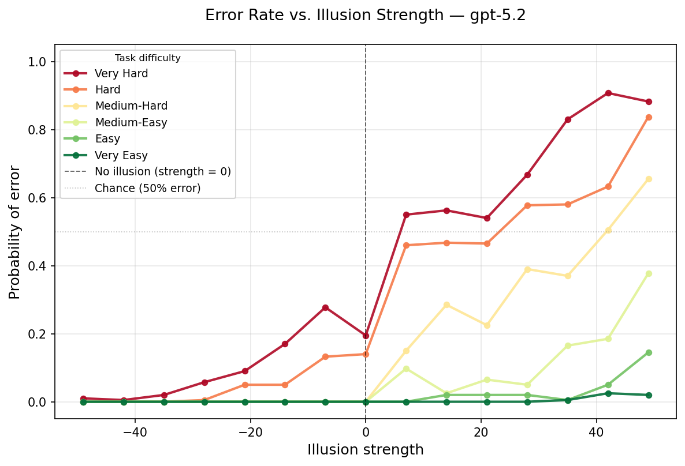
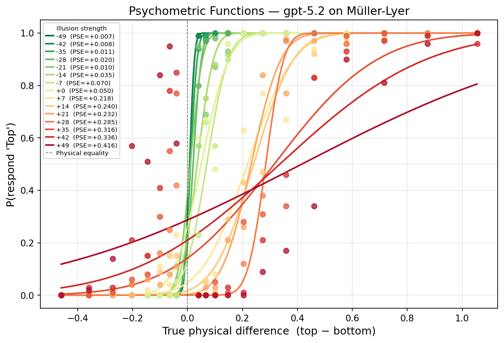
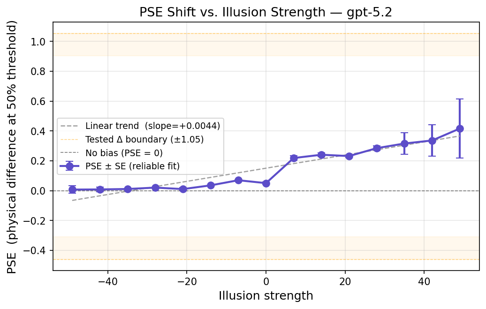

## Pilot Study: Quantifying Visual Priors in GPT-5.2

To validate our psychophysics-first approach, we conducted a pilot study on GPT-5.2 using the classic Müller-Lyer illusion. We treated the Vision-Language Model (VLM) as a human participant, running $N=100$ "synthetic participants" through a strict 2-Alternative Forced Choice (2AFC) task across a rigorously controlled parametric grid of illusion strengths and physical differences.

The results successfully demonstrate that human psychophysical paradigms can extract and quantify latent "visual priors" in generative models.

### 1. The Task & Stimuli

The model was repeatedly asked a simple, objective question: **"Which red line is longer, Top or Bottom?"** By programmatically generating the images, we independently manipulated the _true physical difference_ between the red lines and the _illusion strength_ (the angle of the black fins).

|                            Incongruent (Positive Strength)                            |                        Congruent (Negative Strength)                         |
| :-----------------------------------------------------------------------------------: | :--------------------------------------------------------------------------: |
|         |  |
| _The illusion contradicts reality, making the physically longer line appear shorter._ |     _The fins point outward, visually facilitating the correct answer._      |

### 2. Graded Susceptibility & Asymmetric Bias

_Figure 1: Probability of error as a function of illusion strength and physical task difficulty._

Rather than failing randomly, GPT-5.2 exhibits a systematic, magnitude-dependent susceptibility to the illusion.

- **Interaction with Difficulty:** As the illusion strength increases (moving right on the x-axis), the model's error rate climbs. This effect is heavily amplified on trials where the true physical difference between the lines is small (red/orange lines).
- **Human-like Asymmetry:** The model is highly susceptible to "incongruent" (positive) illusion configurations. However, when presented with "congruent" (negative) configurations, the illusion facilitates the correct answer, dropping the error rate to near zero.

### 3. Systematic Shifting of Perceptual Thresholds

_Figure 2: Fitted cumulative Gaussian psychometric functions for each illusion strength._

By plotting the probability of the model choosing the "Top" line against the true physical difference ($\Delta$), we successfully fitted robust psychometric curves.

- As the positive illusion strength increases (transitioning from yellow to dark red), the entire S-curve smoothly shifts to the right.
- This proves the model is not suffering from a general degradation in reasoning capabilities; instead, its internal threshold for judging "equality" is being systematically manipulated by the geometric context of the image.

### 4. The Core Metric: Point of Subjective Equality (PSE)

_Figure 3: Point of Subjective Equality (PSE) drift across illusion strengths._

To move beyond basic accuracy metrics, we extracted the Point of Subjective Equality (PSE) from the psychometric fits. The PSE represents the exact physical difference required to counteract the model's perception of the illusion.

- The data reveals a clean, monotonic upward drift in PSE. At the maximum tested illusion strength (+49), the target line must be made physically longer by over +0.4 units simply for GPT-5.2 to perceive the two lines as equal.
- **Significance:** This provides a definitive, interpretable scalar metric for a VLM's visual priors. By establishing this methodology, we can now map how these baseline geometric biases (measured here in 2D) predict downstream robustness failures in complex, naturalistic 3D scenes.
